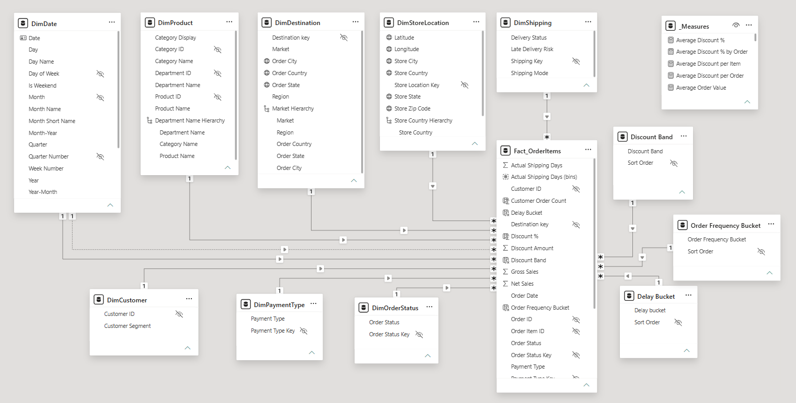
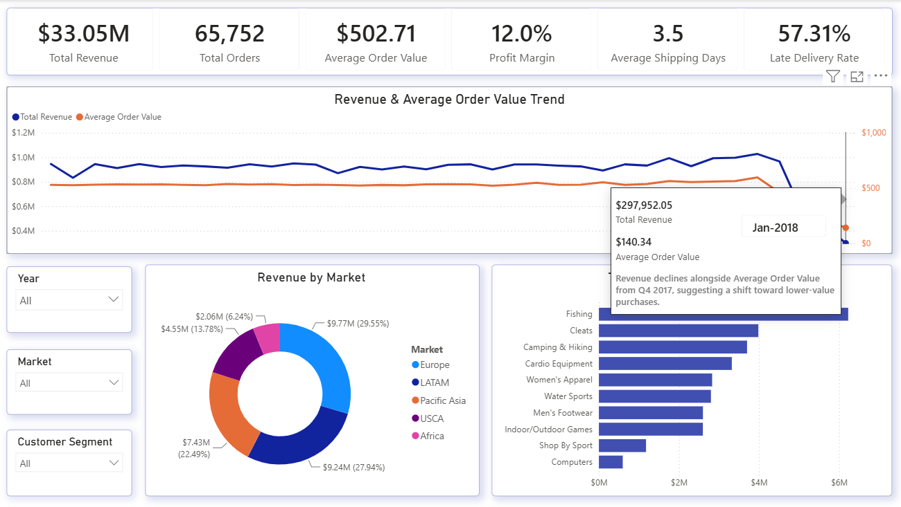
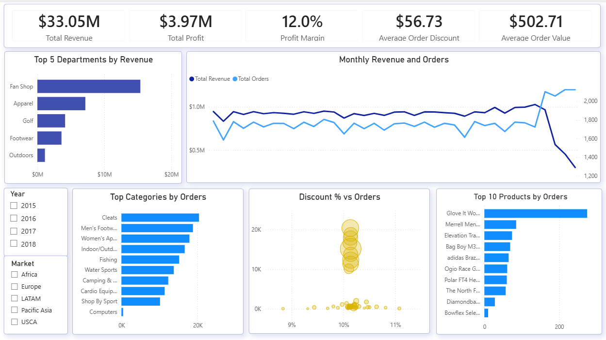
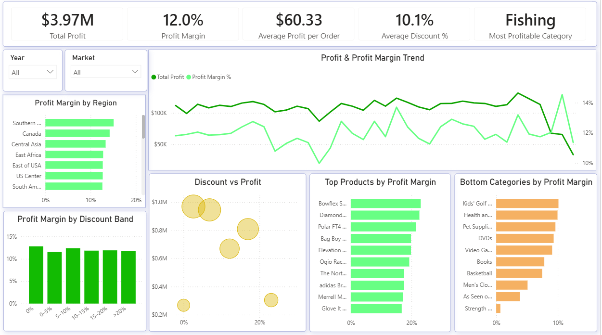
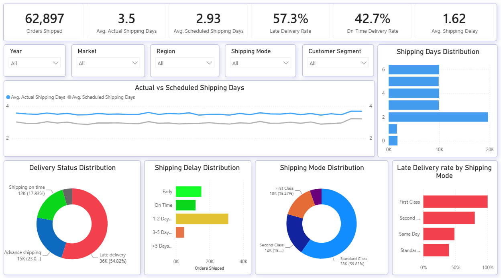
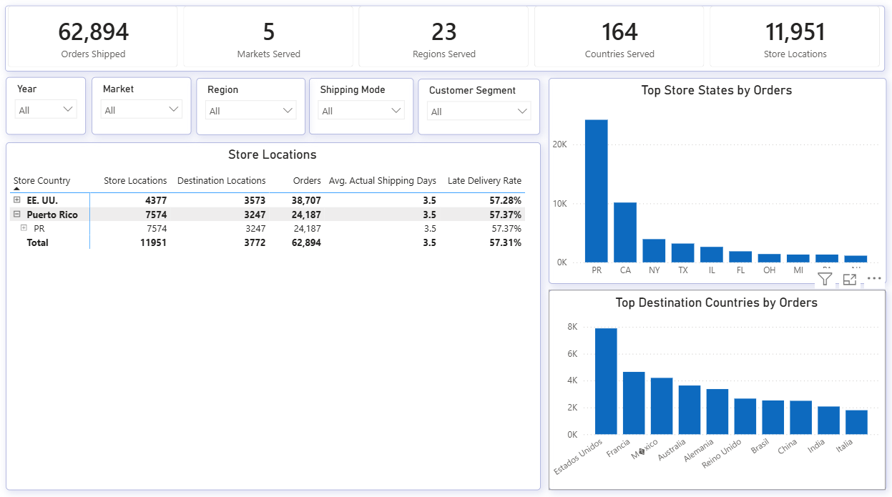
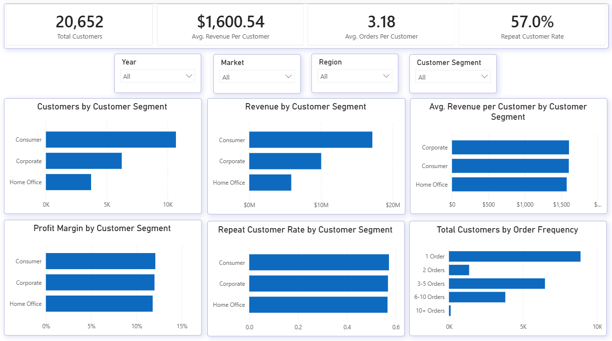
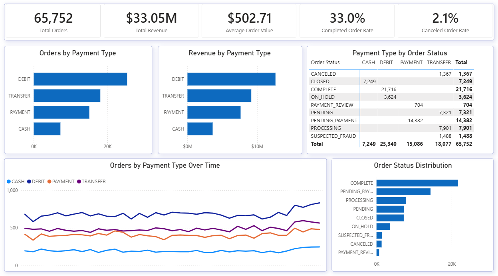

# DataCo SMART Supply Chain Analysis

## Project Summary

An end-to-end Power BI analytics project built using the publicly available DataCo SMART Supply Chain Dataset.

The project analyzes sales, profitability, shipment performance, customer behavior, payment patterns, and geographic/store-network operations through a reusable star-schema semantic model and a seven-page interactive report.

---

## Business Questions

This project aims to answer:

* What are the total sales, total orders, total quantity sold, and average order value?
* How have sales and order volumes changed over time?
* Which markets, departments, categories, and products contribute most to sales?
* What are the total profit, average profit per order, profit margin?
* Which products and product categories generate the highest and lowest profitability?
* How do discounts relate to sales, profit, and profit margin?
* How significant are late deliveries, and how do they vary by shipping mode?
* How is the store and destination network distributed geographically?
* Which customer segments generate the most customers, orders, and revenue?
* What proportion of customers are repeat customers, and how does customer order frequency vary?
* Which payment methods generate the most orders and revenue?
* How is payment type associated with order status?

---

## Dataset

The project uses the **DataCo SMART Supply Chain Dataset**, a publicly available dataset containing data related to provisioning, production, sales, and distribution operations.

The dataset includes information related to:

* Orders and order items
* Products and categories
* Customers and customer segments
* Sales and revenue
* Discounts and profitability
* Payment methods
* Store locations
* Destination locations
* Shipping and delivery performance
* Order and delivery status

The dataset is accompanied by a data dictionary describing the available fields and their intended business meaning.
The dataset provides a useful environment for demonstrating an end-to-end data analytics workflow, from raw-data preparation and semantic modelling through to interactive business analysis and reporting.

---

## Tools

- Power BI Desktop
- Power Query
- DAX
- CSV
- Git / GitHub

---

## Data preparation & modelling

From the raw CSV, the following transformations were applied before referencing the table to build the fact and dimension tables:

* Data types were corrected on the imported columns (e.g., dates to Date/DateTime, numeric fields to whole/decimal number) as a first cleaning step.
* Mixed date formats were standardized after validating the correct interpretation against shipping metrics.
* 16 columns were dropped as not needed for the model — which are personally identifiable customer data, and redundant/duplicate fields.
* The original dataset contained several column names that reflected the source system rather than business entities (e.g., Customer City, Customer State). Based on the data dictionary and data profiling, these columns were determined to represent store locations, not customer addresses. 
* Source-system column names were renamed to business-friendly names.
* Business meaning was verified against the data dictionary rather than inferred from column names.
* Created a display column to distinguish two categories named "Electronics" that belong to different departments, improving report readability while preserving the original category values.
* Some country, state, and city names contain corrupted accented characters (e.g., Jap�n) due to the original dataset's character encoding. Since the original characters cannot be recovered with certainty, these values were retained to preserve data integrity. The issue has minimal impact on the analytical results because grouping and filtering remain unaffected.
* Three records were found with malformed store location fields (ZIP code shifted into the State field and State abbreviation shifted into the City field). The geographic coordinates remained valid, and the records were retained because they have no material impact on the analysis.
* Store location and destination location were modeled as separate dimensions because they represent different business entities.
* Category and Department were denormalized into DimProduct to maintain a clean star schema.

---

## Data Model



---

## Key insights

* Total Revenue of 33.05 million was generated. 
* Revenue began declining from October 2017 and continued to fall through January 2018, alongside a decline in Average Order Value (AOV), suggesting a shift toward lower-value purchases during this period.
* Europe generated the highest revenue (29.6%).
* Higher discount levels are associated with lower total profit, while order volumes remain relatively stable, suggesting that deeper discounts did not generate enough additional demand to offset reduced margins.
* Some individual Dell Laptop transactions have very large losses. But Dell Laptop is profitable overall (11.7% margin). This highlights variation in profitability at the transaction level.
* Other products (like the SOLE E35 Elliptical) are genuinely unprofitable overall.
* 57.3% of the shipped orders were delivered late.
* First Class shipments had a 100% late-delivery rate in the dataset, while Standard Class had the lowest late-delivery rate at 39.85%.  
* The company's store network is concentrated across several states in two countries, EE. UU., and Puerto Rico, while its destination network extends across the world.
* Most orders were served from PR state, followed by CA and NY. Most orders were shipped to Estados Unidos, followed by Francia and Mexico.
* Debit is the largest payment method by orders and revenue. 
* The order-status distribution shows a large share of orders Completed, but also substantial numbers in Pending Payment, Processing and Pending.
* The payment-type/status matrix shows a strong association between payment type and order status:
    Debit orders are concentrated in Complete and On Hold statuses, while Payment orders are concentrated in Payment Review and Pending Payment. Transfer orders span several statuses, including Canceled, Pending, Processing, and Suspected Fraud.


---

## Dashboard pages

The report is organized into seven pages

Executive Overview: Top-line KPIs, revenue and order trends, market contribution, and high-level product performance.


Sales Analysis: Revenue and order performance across departments, categories, and products, with discount context.


Profitability Analysis: Profitability trends and margins across regions, products, and discount bands.


Shipment Performance: Shipping duration, delivery status, delay distribution, and late-delivery performance by shipping mode.


Geographic & Network Insights: Store-network distribution, destination footprint, and operational performance across locations.


Customer Analysis: Customer segments, revenue per customer, profitability, repeat-customer rate, and order-frequency distribution.


Payment Analysis: Payment-method mix, revenue contribution, payment trends, and the relationship between payment type and order status.


---

## Key Data Challenges & Decisions

* Excluded Shipping Canceled orders from shipment performance KPIs because they don't represent completed deliveries, while documenting that the source data still contains shipping dates for these records.
* Used Orders Shipped rather than order-item counts for shipment metrics to avoid overstating operational volume.
* Created a display column to distinguish two categories named "Electronics" that belong to different departments, improving report readability while preserving the original category values.
* Some country, state, and city names contain corrupted accented characters (e.g., Jap�n) due to the original dataset's character encoding. Since the original characters cannot be recovered with certainty, these values were retained to preserve data integrity. The issue has minimal impact on the analytical results because grouping and filtering remain unaffected.
* Three records were found with malformed store location fields (ZIP code shifted into the State field and State abbreviation shifted into the City field). The geographic coordinates remained valid, and the records were retained because they have no material impact on the analysis.

---

## Limitations

* The Power BI report was developed in Power BI Desktop and is not published as an interactive Power BI Service report.
* Some source geographic fields contain encoding or data-quality issues that were retained rather than altered when the original values could not be reliably recovered.
* The dataset does not provide sufficient information to determine whether certain canceled-order payments were subsequently refunded.

---

## Repository Structure

```
DataCo Smart Supply Chain Analysis/
│
├── README.md
│
├── DataCo Smart Supply Chain Analysis.pbix
│
├── images/
│   ├── Data_Model.PNG
│   ├── Executive_OverviewTT.PNG
│   ├── Sales_Analysis.PNG
│   ├── Profitability_Analysis.PNG
│   ├── Shipment_Performance.PNG
│   ├── Geographic_&_Network_Insights.PNG
│   ├── Customer_Analysis.PNG
│   ├── Payment_Analysis.PNG
│
└── dataset/
```

---

## Acknowledgements

This project uses the **DataCo SMART Supply Chain Dataset by DataCo Global**, made publicly available for learning and analytical purposes.

The project was developed as a portfolio project to demonstrate data analysis with Power BI using real-world transactional and logistics data.
